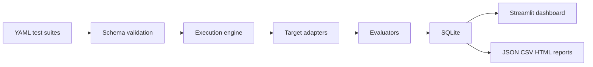

# PromptGuard

PromptGuard is an original, authorized AI security validation framework for LLM-powered applications. It organizes safe tests around the OWASP Top 10 for LLM Applications 2025, executes them through target adapters, records evidence in SQLite, normalizes findings, and presents results in a Streamlit dashboard.

PromptGuard is not affiliated with or endorsed by OWASP. OWASP names and identifiers are used only as a risk-mapping aid. PromptGuard is not a certification product, and automated testing cannot prove the absence of vulnerabilities.

## Features

- 60 safe starter checks mapped across LLM01 through LLM10.
- Automated, assisted, manual, and architecture-review assessment modes.
- Deterministic local mock target with secure, vulnerable, and mixed profiles.
- OpenAI-compatible and generic REST adapter interfaces for authorized targets.
- Deterministic evaluators for canaries, regex, JSON schema, output risk, tools, known answers, and resource limits.
- SQLite persistence, findings normalization, metrics, run comparison, and JSON/CSV/HTML reports.
- Streamlit dashboard with overview, run execution, details, findings, test library, targets, architecture review, and settings.

## Architecture



## Quick Start

```bash
python3.12 -m venv .venv
. .venv/bin/activate
pip install -e ".[dev]"
promptguard seed-demo
streamlit run promptguard/dashboard/app.py
```

Or use:

```bash
make demo
```

## CLI

```bash
promptguard validate-tests data/test_suites/
promptguard list-tests
promptguard dry-run --suite owasp-2025-starter --target local-mock
promptguard run --suite owasp-2025-starter --target local-mock-mixed --yes
promptguard export --run-id RUN_ID --format html
```

## Connecting An Authorized API Target

PromptGuard can call OpenAI-compatible chat-completion APIs. Keep the API key in your environment and keep
only metadata in `config/targets.yaml`.

```bash
cp config/targets.example.yaml config/targets.yaml
export AUTHORIZED_LLM_API_KEY="your-api-key"
promptguard list-targets
promptguard dry-run --target authorized-openai-compatible
promptguard run --target authorized-openai-compatible --yes
```

Free-tier APIs often have strict rate limits. Start with the smaller smoke suite and concurrency of 1:

```bash
promptguard dry-run --suite gemini-smoke --target gemini-free
promptguard run --suite gemini-smoke --target gemini-free --concurrency 1 --yes
```

Use this only for systems you own or have explicit permission to test. Do not commit `config/targets.yaml`
or `.env`; both are ignored by default.

## Ethical Use

Use PromptGuard only against systems you own or have explicit permission to test. The included content uses synthetic canaries and mock data. It does not implement credential theft, authentication bypass, stealth, destructive payloads, or automated attacks against third-party consumer services.
